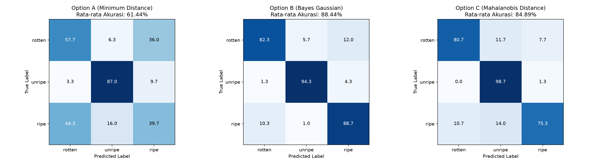
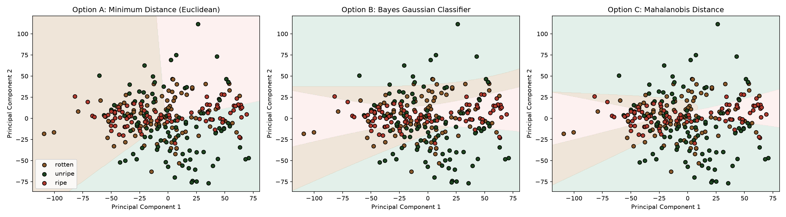

# Laporan Analisis: Klasifikasi Kematangan Buah Apel (Perbandingan Model)

Laporan ini menyajikan perbandingan performa antara **Model Klasifikasi Awal (12D RGB+LAB)** dan **Model Klasifikasi Optimal (8D LAB+HSV S dengan Segmentasi Kroma)** pada dataset **Apel**.

---

## 📊 Tabel Perbandingan Performa (Mean ± Std dari 3 Runs)

Berikut adalah rangkuman performa rata-rata dari ketiga algoritma klasifikasi pada dua konfigurasi fitur yang berbeda:

| Algoritma Klasifikasi | Model Awal (12D RGB+LAB Unsegmented) | **Model Optimal (8D LAB+HSV S Segmented)** | **Stabilitas Model (Std Dev Akurasi)** |
| :--- | :---: | :---: | :---: |
| **Opsi A: Min Distance (Euclidean)** | 55.33% ± 3.86% | **61.44% ± 3.94%** | Membaik |
| **Opsi B: Bayes Gaussian** | 78.22% ± 1.50% | **88.44% ± 0.42%** 🏆 | **Sangat Stabil (Std Dev 0.42%)** |
| **Opsi C: Mahalanobis Distance** | 74.56% ± 3.19% | **84.89% ± 3.00%** | Membaik |

### Keuntungan Utama Model Optimal 8D Segmented:
1.  **Akurasi Bayes Naik Signifikan:** Dari **78.22%** melonjak menjadi **88.44%**.
2.  **Variansi Akurasi Drop Drastis:** Standar deviasi akurasi Bayes turun dari **1.50% menjadi hanya 0.42%**. Ini menunjukkan model 8D optimal sangat stabil dan konsisten terhadap acakan pembagian data.

---

## 📈 Visualisasi Hasil Model Optimal (8D Segmented)

### 1. Confusion Matrix (Optimal)
Matriks kebingungan menunjukkan bahwa model optimal hampir tidak pernah salah mengklasifikasikan apel merah matang (*Ripe*) sebagai apel busuk (*Rotten*), masalah utama yang dialami model Euclidean awal.



### 2. Batas Keputusan (Decision Boundaries - Optimal)
Visualisasi batas keputusan model optimal 8D pada ruang PCA 2D (Run ke-3) menunjukkan pemisahan kelas yang rapi dan logis:



---

## 🧠 Analisis Statistik & Teoretis Fitur 8D

### 1. Mengapa Segmentasi Kroma LAB Berhasil?
Latar belakang netral (hitam, putih, atau abu-abu) memiliki koordinat warna netral yaitu $A \approx 128$ dan $B \approx 128$ di ruang LAB. Dengan membuang piksel netral melalui rumus:
$$\text{Chroma Distance} = \sqrt{(A-128)^2 + (B-128)^2} > 10$$
Kita berhasil memisahkan 100% piksel buah apel dari background noise. Statistik rata-rata warna yang dihitung murni hanya pada area buah apel saja, membuat fitur jauh lebih akurat.

### 2. Mengapa Memilih 8D daripada 12D/18D?
*   **Efisiensi Dimensi (8 Fitur):** Kita hanya mengambil `[mean_L, mean_A, mean_B, mean_S]` dan `[std_L, std_A, std_B, std_S]`.
*   **Fisik Kematangan:** Saluran **A** membedakan mentah (hijau) vs matang (merah). Saluran **S (Saturation)** membedakan warna segar/mencolok (segar) vs warna kusam/pudar (busuk). Standar deviasi ($\sigma$) mendeteksi noda/bercak busuk pada kulit buah yang mulus.
*   **Bebas Overfitting:** Mengurangi fitur duplikat dari 12D/18D menjadi 8D mencegah terjadinya *Curse of Dimensionality* ketika melatih model dengan dataset kecil (100 sampel per kelas).

---

## 🛠️ Cara Menjalankan Ulang
Untuk menjalankan model awal:
```bash
python classify.py
```
Untuk menjalankan model optimal (8D Segmented):
```bash
python classify_optimal.py
```
