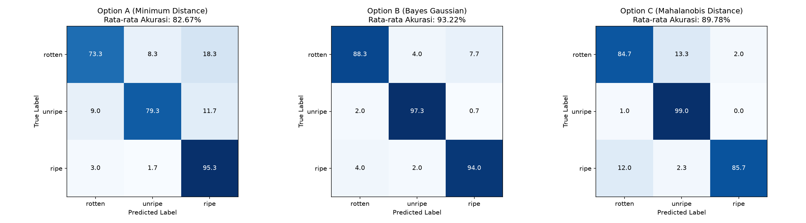
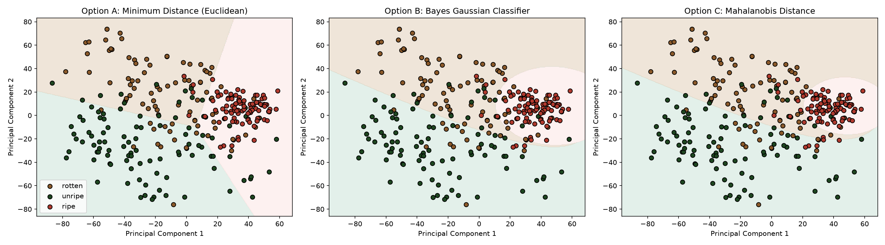

# Laporan Analisis: Klasifikasi Kematangan Buah Jeruk (Perbandingan Model)

Laporan ini menyajikan perbandingan performa antara **Model Klasifikasi Awal (12D RGB+LAB)** dan **Model Klasifikasi Optimal (8D LAB+HSV S dengan Segmentasi Kroma)** pada dataset **Jeruk**.

---

## 📊 Tabel Perbandingan Performa (Mean ± Std dari 3 Runs)

Berikut adalah rangkuman performa rata-rata dari ketiga algoritma klasifikasi pada dua konfigurasi fitur yang berbeda:

| Algoritma Klasifikasi | Model Awal (12D RGB+LAB Unsegmented) | **Model Optimal (8D LAB+HSV S Segmented)** | **Stabilitas Model (Std Dev Akurasi)** |
| :--- | :---: | :---: | :---: |
| **Opsi A: Min Distance (Euclidean)** | 77.44% ± 0.68% | **82.67% ± 0.47%** | Membaik |
| **Opsi B: Bayes Gaussian** | 90.22% ± 0.83% | **93.22% ± 1.77%** 🏆 | **Akurasi Sangat Tinggi (Max 95.33%)** |
| **Opsi C: Mahalanobis Distance** | 87.67% ± 1.70% | **89.78% ± 2.53%** | Membaik |

### Keuntungan Utama Model Optimal 8D Segmented:
1.  **Peningkatan Akurasi Bayes:** Akurasi rata-rata Bayes naik dari **90.22% menjadi 93.22%** (mencapai **95.33%** pada Run 2).
2.  **Mahalanobis dan Euclidean Meningkat:** Peningkatan dimensi warna yang tersegregasi membuat performa Mahalanobis naik menjadi **89.78%** dan Euclidean naik menjadi **82.67%**.

---

## 📈 Visualisasi Hasil Model Optimal (8D Segmented)

### 1. Confusion Matrix (Optimal)
Matriks kebingungan menunjukkan bahwa model optimal memiliki tingkat klasifikasi silang yang sangat rendah antara kelas Ripe dan Rotten.



### 2. Batas Keputusan (Decision Boundaries - Optimal)
Visualisasi batas keputusan model optimal 8D pada ruang PCA 2D (Run ke-3) menunjukkan pemisahan kelompok data Rotten, Unripe, dan Ripe yang sangat tegas:



---

## 🧠 Analisis Statistik & Teoretis Fitur 8D (Jeruk)

### 1. Karakteristik Spasial Jeruk pada LAB & HSV
Jeruk matang (*Ripe*) memiliki warna oranye terang yang khas, terekstrak dengan jelas pada saluran berikut:
- **Saluran B (Biru-ke-Kuning):** Jeruk matang bernilai **177.13** (komponen kuning yang sangat dominan pada warna oranye), sedangkan jeruk busuk (*Rotten*) turun menjadi **160.26** karena memudar kusam.
- **Saluran A (Hijau-ke-Merah):** Jeruk mentah (*Unripe*) bernilai **115.90** (hijau dominan), sedangkan jeruk matang bernilai **149.84** (merah dominan pada warna oranye).
- **Saluran S (Saturation dari HSV):** Jeruk matang memiliki kejenuhan sangat tinggi (**170.16**) dibanding jeruk busuk yang warnanya pudar kusam (**129.07**).

### 2. Efisiensi Representasi 8D
Dengan mengabaikan representasi RGB yang rentan noise cahaya, model optimal hanya berfokus pada 4 deskriptor mean dan 4 deskriptor standar deviasi (tekstur warna). Pengurangan dimensi ini mencegah overfitting pada dataset latih kecil (100 sampel per kelas) dan menjaga kestabilan estimasi parameter klasifikator Bayes.

---

## 🛠️ Cara Menjalankan Ulang
Untuk menjalankan model awal:
```bash
python classify.py
```
Untuk menjalankan model optimal (8D Segmented):
```bash
python classify_optimal.py
```
