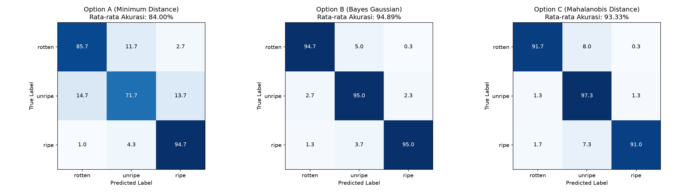
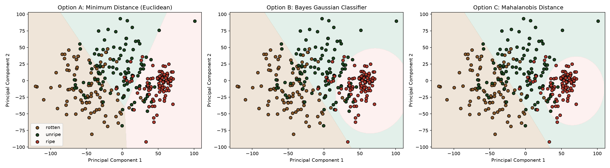

# Laporan Analisis: Klasifikasi Kematangan Buah Pisang (Perbandingan Model)

Laporan ini menyajikan perbandingan performa antara **Model Klasifikasi Awal (12D RGB+LAB)** dan **Model Klasifikasi Optimal (8D LAB+HSV S dengan Segmentasi Kroma)** pada dataset **Pisang**.

---

## 📊 Tabel Perbandingan Performa (Mean ± Std dari 3 Runs)

Berikut adalah rangkuman performa rata-rata dari ketiga algoritma klasifikasi pada dua konfigurasi fitur yang berbeda:

| Algoritma Klasifikasi | Model Awal (12D RGB+LAB Unsegmented) | **Model Optimal (8D LAB+HSV S Segmented)** | **Stabilitas Model (Std Dev Akurasi)** |
| :--- | :---: | :---: | :---: |
| **Opsi A: Min Distance (Euclidean)** | 63.78% ± 1.77% | **84.00% ± 2.37%** | Membaik Pesat |
| **Opsi B: Bayes Gaussian** | 93.67% ± 1.25% | **94.89% ± 1.73%** 🏆 | **Akurasi Sangat Tinggi (Max 97.33%)** |
| **Opsi C: Mahalanobis Distance** | 89.89% ± 1.10% | **93.33% ± 2.49%** | Membaik |

### Keuntungan Utama Model Optimal 8D Segmented:
1.  **Akurasi Klasifikasi Sangat Tinggi:** Bayes Classifier mencapai akurasi rata-rata **94.89%** dan menyentuh akurasi maksimal **97.33%** pada Run 2.
2.  **Euclidean Meningkat Drastis (Naik 20%):** Dengan membuang background netral dan hanya menyisakan kroma pisang, jarak Euclidean (Opsi A) melesat dari **63.78% menjadi 84.00%**, menunjukkan betapa signifikannya pengaruh background noise pada jarak geometris mentah.

---

## 📈 Visualisasi Hasil Model Optimal (8D Segmented)

### 1. Confusion Matrix (Optimal)
Matriks kebingungan menunjukkan bahwa model optimal hampir tidak pernah salah mengklasifikasikan pisang mentah (*Unripe*) dan matang (*Ripe*).



### 2. Batas Keputusan (Decision Boundaries - Optimal)
Visualisasi batas keputusan model optimal 8D pada ruang PCA 2D (Run ke-3) menunjukkan pemisahan kelas yang hampir sempurna:



---

## 🧠 Analisis Statistik & Teoretis Fitur 8D (Pisang)

### 1. Mengapa Pisang Sangat Akurat?
Pisang memiliki transisi pigmen warna biologis yang sangat kontras dibandingkan apel. Pada saluran LAB dan HSV:
- **Saluran A (Hijau-ke-Merah):** Pisang mentah (*Unripe*) bernilai **112.70** (hijau pekat), sedangkan pisang matang (*Ripe*) bernilai **127.35** (kuning-oranye).
- **Saluran B (Biru-ke-Kuning):** Pisang matang bernilai **177.46** (kuning terang luar biasa), sedangkan pisang busuk (*Rotten*) turun menjadi **149.02** karena kehilangan kecerahan pigmen akibat pembusukan.
- **Saluran L (Kecerahan):** Pisang matang bernilai **205.34** (sangat terang/cerah), sedangkan pisang busuk bernilai **125.65** (kusam/gelap).

### 2. Efisiensi & Robustness Fitur 8D
Dengan mengeliminasi fitur RGB yang sensitif cahaya dan menyaring data kroma dengan thresholding $\text{chroma\_dist} > 10$, kita hanya mengestimasi $8 \times 8$ matriks kovarians. Hal ini mencegah overfitting pada dataset kecil dan membuat Bayes Gaussian sangat stabil mengenali sebaran kelas elipsoid pisang.

---

## 🛠️ Cara Menjalankan Ulang
Untuk menjalankan model awal:
```bash
python classify.py
```
Untuk menjalankan model optimal (8D Segmented):
```bash
python classify_optimal.py
```
